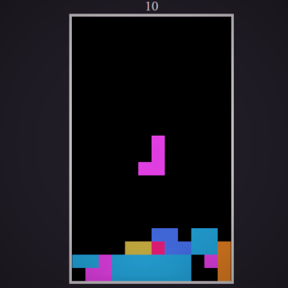

# *Showcase Of my JavaScript Projects.*

> **Provided below are the projects that I developed during my college years using Javascript(ES5+ES6),Hope you like them** :collision:

------------------------------------------------------------

1. ### Tetris :wind_chime: (Single Player)
  > Developed Using Javascript functions and Matrices depicting the game pieces.Currently I am hoping to refactor my code,to integrate
  2 player system and work on some existing glitches pointed out by colleagues.

  > This project involved some basic aspects listed below. :point_down:
  
  1. Drawing on a canvas.
  2. Representing pieces using a [Matrix](medium.com/@markmliu/the-tetris-proof-60a7a69a8e04).
  3. Rotating a matrix.
  4. Rudimentary requestAnimation Frame listening.
  5. Handling keyboard input.
 
 
  
  
